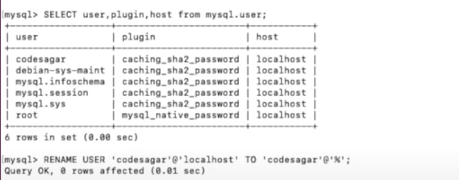

# How To access MySQL 8.0 installed on an AWS instance from your local machine (localhost):

  <b> If you are video oriented use this [youtube-video](https://youtu.be/4QrQlKtluK8)</b>

### 1. MySQL Configuration on AWS Instance

First, make sure MySQL is configured to accept remote connections. By default, MySQL may be bound to accept connections only from localhost (127.0.0.1). To allow remote connections, you need to modify the MySQL configuration file (`my.cnf` or `my.ini` depending on your MySQL version and OS).

Here’s how you can modify the MySQL configuration file:

- SSH into your AWS instance where MySQL is installed.
- Locate and edit the MySQL configuration file (usually located at `/etc/mysql/mysql.conf.d/mysqld.cnf` on Ubuntu).

  Find the line that looks like this:
  ```
  bind-address = 127.0.0.1
  ```
  
  Comment out this line or change it to listen on all interfaces:
  ```
  # bind-address = 127.0.0.1
  ```

  Or, if you want to listen on all interfaces, change it to:
  ```
  bind-address = 0.0.0.0
  ```

  Save the file and restart MySQL to apply the changes:

  ```bash
  sudo systemctl restart mysql
  ```

### 2. MySQL User and Permissions

Ensure that the MySQL user you intend to use from your local machine has permissions to connect from your IP address or from any host (`%`). By default, MySQL might create users that can only connect from localhost.

To grant remote access to a MySQL user from your local machine:

- Log into MySQL on your AWS instance:

  ```bash
  mysql -u root -p
  ```

- Grant permissions to a user (replace `<username>` and `<password>` with your desired username and password):


[copyright-source](https://stackoverflow.com/a/50197630)

Alternatively  if you have a user you can grant him remote privileges as follows:


 [copyright-source](https://youtu.be/4QrQlKtluK8)

  This grants full privileges (`ALL PRIVILEGES`) on all databases (`*.*`) to `'username'` from any host (`'%'`). Adjust the privileges and host specification as needed based on your security requirements.

- To view all users use the following command:
    ```sql
          select user, plugin, host from mysql.user;
    ```

- Flush privileges to apply the changes:

  ```sql
  FLUSH PRIVILEGES;
  ```

- Exit MySQL:

  ```sql
  EXIT;
  ```

### Security Considerations:

- **Firewall and Security Groups**: Ensure that the MySQL port (default 3306)
To set up inbound rules for MySQL on port 3306, typically within an AWS EC2 environment using security groups, follow these steps:

1. **Identify Security Groups**: Determine the security groups associated with your MySQL database server. You can find this information in the AWS Management Console under EC2 > Instances > Instances (select your MySQL instance) > Description tab > Security groups.

2. **Edit Inbound Rules**: Navigate to the EC2 dashboard in the AWS Management Console and go to the **Security Groups** section.

3. **Select Security Group**: Find and select the security group that is associated with your MySQL database server.

4. **Add Rule for MySQL (Port 3306)**:
   - Click on the **Inbound rules** tab.
   - Click on the **Edit inbound rules** button (if available) or **Add rule** button.
   - Select **MySQL/Aurora (3306)** from the **Type** dropdown list. If you do not see MySQL/Aurora (3306), you can select **Custom TCP** and enter **3306** as the port range.
   - For **Source**, specify the IP address range, security group ID, or security group name from which you want to allow incoming MySQL connections. 

     - To allow connections from anywhere, you can use **0.0.0.0/0** (which allows all IPv4 addresses) or **::/0** (which allows all IPv6 addresses).
     - For better security, specify the specific IP address range of your web or application servers.

5. **Save Rules**: After specifying the inbound rule, click **Save rules** or **Add rule** to apply the changes.

6. **Verify Connectivity**: Test the connection from your web or application server to the MySQL database server to ensure that the inbound rule is correctly configured and the connection can be established.


### 3. Access MySQL from Localhost

Now, from your local machine (localhost), you can connect to the MySQL instance running on your AWS instance using a MySQL client (such as MySQL Workbench, Sequel Pro, or the MySQL command-line client).

Use the public IP address or DNS name of your AWS instance and the MySQL port (default is 3306):

```bash
mysql -u username -h <AWS_Instance_Public_IP_or_DNS> -p
```

Replace `<AWS_Instance_Public_IP_or_DNS>` with the public IP address or DNS name of your AWS instance, and `username` with the MySQL username you granted permissions to.

### Example:

Assuming your AWS instance's public IP address is `123.456.789.123` and MySQL username is `remote_user`, you would connect like this:

```bash
mysql -u remote_user -h 123.456.789.123 -p
```

Enter the MySQL user password when prompted.


